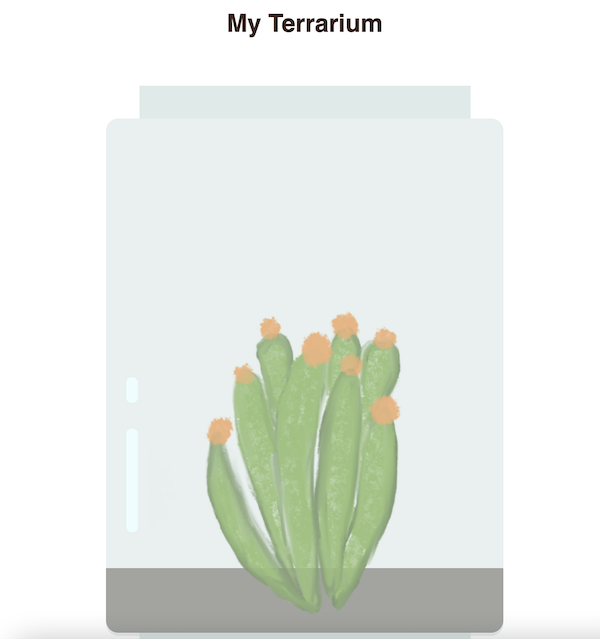

# Build a tiny terrarium with HTML and CSS!

With this repo, you can create a little one-plant terrarium. Other images in the images folder are available for future creativity.

Tinker with the HTML and CSS to edit your layout. Make sure that it scales well when you resize your browser (aka: is 'responsive'). 

